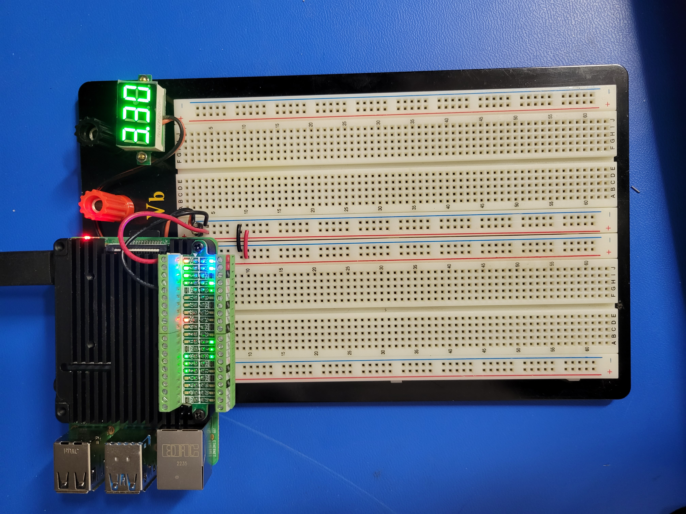
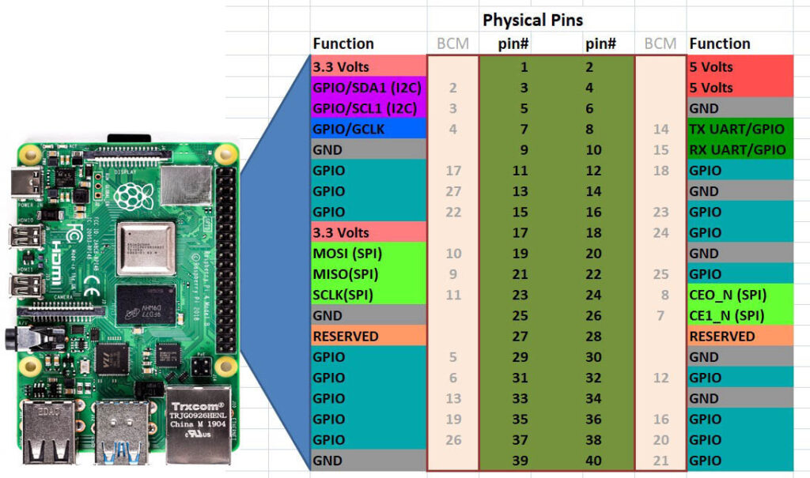
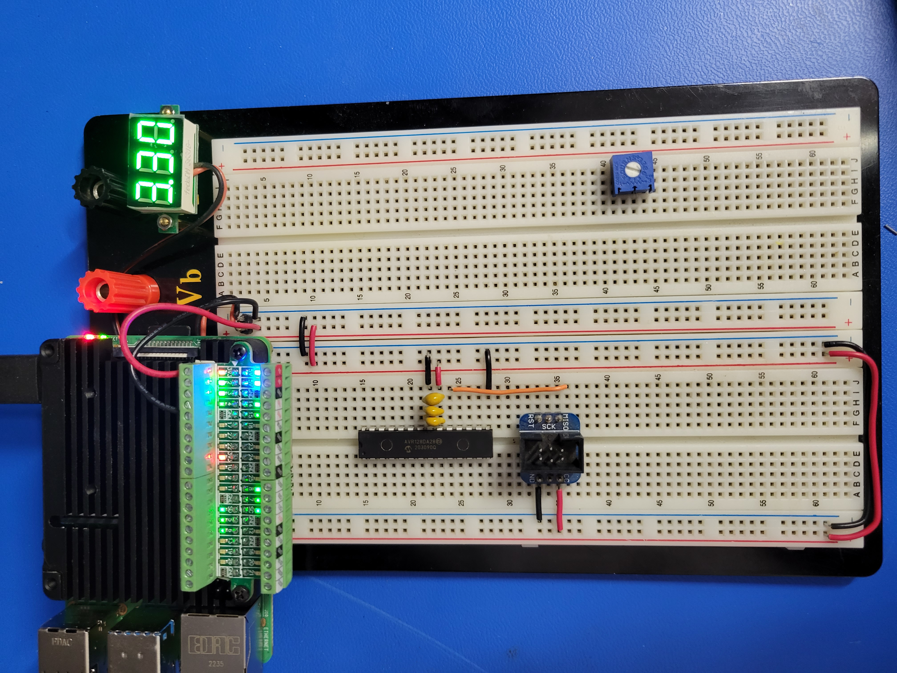
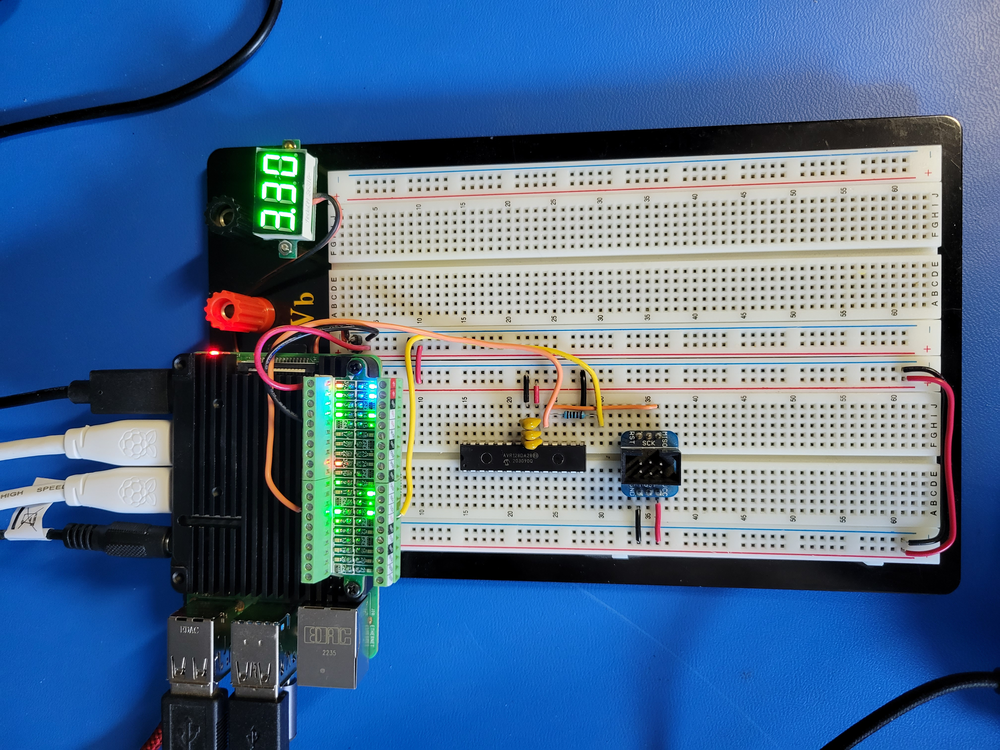
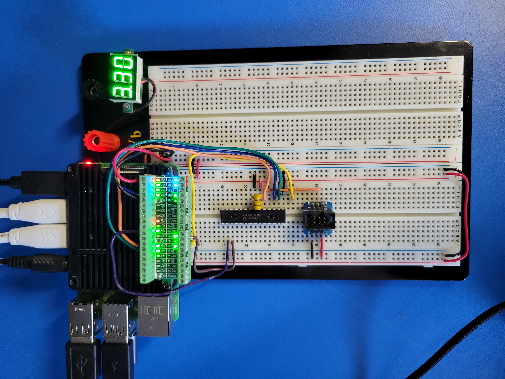
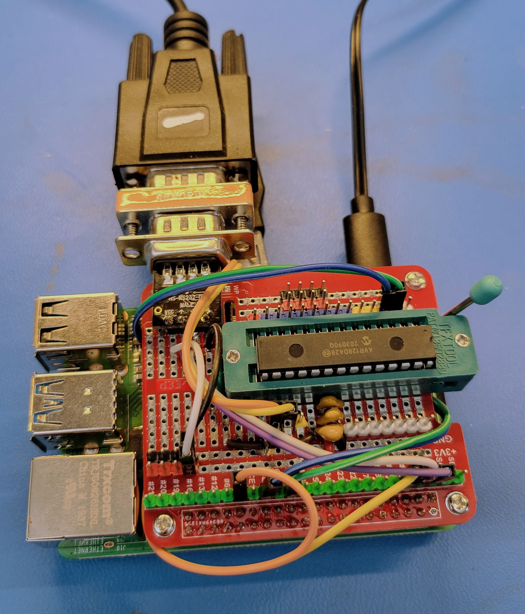

# avrOSdb — User Manual

`avrOSdb` is a host-side GDB Remote Serial Protocol (RSP) server that
bridges `avr-gdb` to AVR DA/DB targets over the UPDI single-wire debug
interface. It adds first-class awareness of [avrOS](https://github.com/racerxr650r/avrOS)
cooperative FSM tasks, exposing each registered FSM's state through `monitor avros` introspection.

This manual covers installation, hardware connection, command-line invocation,
worked examples, and integration with VS Code's built-in debugger UI.

---

## 1. Prerequisites

The following host tools are required to build and use `avrOSdb`:

| Tool | Minimum version | Purpose |
| ---- | --------------- | ------- |
| `gcc` (or `clang`) | gcc ≥ 4.8 / clang ≥ 3.4 | C99 host compiler for `avrOSdb` and the unit tests |
| `make` | ≥ 3.81 | Build orchestration (`all`, `test`, `install`, `bundle`) |
| `avr-gcc` | ≥ 12.0 | AVR cross-compiler (only needed when compiling firmware or test fixtures) |
| `avr-binutils` | matching `avr-gcc` | Provides `avr-nm`, used to verify ELF symbols |
| `avr-gdb` | ≥ 12.0 | The GDB client that connects to `avrOSdb` |

Optional tools:

| Tool | Purpose |
| ---- | ------- |
| `dpkg-deb` | Required for `make bundle` to produce a `.deb` package |
| `rpmbuild` | Required for `make bundle` to produce an `.rpm` package |
| `ruby` | Validates the Homebrew formula produced by `make bundle` |
| `man` / `groff` | Renders the installed Unix man page |

Run `make check-tools` to verify the required tools are present before
attempting a build:

```bash
$ make check-tools
All required tools found.
```

The target exits with a non-zero status and prints a diagnostic naming each
missing tool when any required dependency is absent.

---

## 2. Build

From the repository root:

```bash
make             # builds build/avrOSdb
make test        # builds and runs all unit + integration tests
make install     # installs binary + man page under $(PREFIX)
```

Useful variables:

| Variable | Default | Effect |
| -------- | ------- | ------ |
| `PREFIX` | `/usr/local` | Install prefix used by `install` and `uninstall` |
| `VERSION` | `git describe` or `0.0.0` | Package version label used by `make bundle` |
| `ASAN=1` | unset | Adds `-fsanitize=address,undefined` to host + test builds |
| `V=1` | unset | Verbose build (echo full compile/link commands) |

To install to a non-standard prefix (no sudo required):

```bash
make install PREFIX=$HOME/.local
```

To remove an installation:

```bash
make uninstall PREFIX=$HOME/.local
```

`uninstall` is idempotent — it exits successfully even if the files have
already been removed.

To produce native distribution packages under `dist/`:

```bash
make bundle VERSION=0.1.0
# dist/avrOSdb_0.1.0_amd64.deb
# dist/avrOSdb-0.1.0-1.x86_64.rpm
# dist/avrOSdb.rb         (Homebrew formula)
```

`bundle-deb`, `bundle-rpm`, and `bundle-brew` may be built individually.
The `.deb` target requires `dpkg-deb`; the `.rpm` target requires
`rpmbuild`. Each target prints a clear diagnostic and exits non-zero
when its packaging tool is unavailable.

---

## 3. Connection Wiring

UPDI is a half-duplex, single-wire debug protocol that multiplexes
transmit and receive on a single line. A standard 3.3 V USB-to-serial
adapter can drive UPDI when wired with a series resistor:

```
   USB-serial TX  ── 1 kΩ ──┬──── UPDI (target)
                            │
   USB-serial RX  ──────────┘

   USB-serial GND ───────────────── GND (target)
```

Key points:

- **Single wire only.** The USB-serial `TX` (through the 1 kΩ resistor)
  and `RX` (direct) are tied together at the UPDI node; the AVR sees a
  single bidirectional UPDI line.
- **1 kΩ series resistor on the adapter TX line only.** It isolates the
  driver from echoes generated by the target and limits current when
  the line is contended. `RX` taps the UPDI node directly so it sees
  full-amplitude target responses.
- **Common ground** between adapter and target is mandatory — the
  ground wire connects `GND` to `GND` only; UPDI is **not** shorted to
  ground. Power the target from a clean 3.3 V supply; UPDI is not 5 V
  tolerant on most AVR DA/DB parts.
- **No additional reset wiring.** UPDI generates the BREAK condition
  via baud-rate manipulation; no `nRESET` line is required.

On Linux the serial adapter typically appears as `/dev/ttyUSB0` (FT232,
CP210x) or `/dev/ttyACM0` (CDC ACM); on a Raspberry Pi's built-in UART it is
`/dev/ttyAMA*` (e.g. `/dev/ttyAMA2`).

---

## 4. Command-Line Invocation

```
avrOSdb [--port <port>] [--baud <baud>] [--erase] [--load] [--no-verify] [--allow-lock-updi] [--allow-erase] [--force-device <family>] <serial-device> <elf-file>
avrOSdb --prog [--baud <baud>] [--erase] [--no-verify] [--allow-lock-updi] [--force-device <family>] <serial-device> <elf-file>
avrOSdb --device [--baud <baud>] [--no-autobaud] [--force-device <family>] <serial-device> [elf-file]
```

### Options

| Option | Type | Default | Description |
| ------ | ---- | ------- | ----------- |
| `--port <port>` | uint16_t | `1234` | TCP port to listen on for the `avr-gdb` client. Range: `1 ≤ port ≤ 65535`. |
| `--baud <baud>` | int | `115200` | UART baud rate to the UPDI adapter. Must be a positive integer accepted by the host `termios` layer. |
| `--load` | flag | unset | Before entering the event loop, program every `PT_LOAD` segment of the supplied ELF to the matching AVR-Dx NVM kind (FLASH, EEPROM, USERROW, FUSES, LOCK) via the UPDI NVM controller. Segments are classified by virtual address against the unified UPDI windows; SIGROW segments are skipped (read-only); segments outside every programmable window cause `--load` to fail. After `--load` completes the loader performs a read-back verify (see `--no-verify` below). |
| `--erase` | flag | unset | Issue a UPDI chip-erase before any `--load` step. Required when the ELF contains a LOCK segment (lockbits can only be re-programmed after a chip-erase clears `LOCKSTATUS`). |
| `--prog` | flag | unset | Program-and-exit (CI / build-server) mode. Equivalent to `--load` followed by an immediate orderly exit — no GDB TCP listener is opened, the target is **not** halted, and the CPU starts running the freshly programmed image. On success the loader prints `verify: OK` to stdout and exits 0. Mutually exclusive with `--load` and `--device`. |
| `--no-verify` | flag | unset | Suppress the read-back verify pass that normally follows `--load` or `--prog`. Use sparingly — verify is the only mechanism that detects partial or silently-corrupted writes. |
| `--no-autobaud` | flag | unset | (Used with `--device` only.) Suppress the link-quality auto-baud probe and use the rate supplied via `--baud` (or its default) unchanged. |
| `--allow-lock-updi` | flag | unset | Allow `--load` to write LOCK byte patterns that would assert `UPDIDIS` and permanently disable the UPDI debug interface. Without this flag only the 4-byte unlock pattern `0x5CC5C55C` is accepted; every other LOCK value is rejected. |
| `--allow-erase` | flag | unset | Permit the GDB-side `monitor erase` and `monitor chip-erase` verbs to issue a UPDI chip-erase on the running target. Without this flag both verbs return an error code (`E11`) and leave the silicon untouched. Has no effect on the boot-time `--erase` flag. (HLR-055.) |
| `--device` | flag | unset | One-shot diagnostic: open UPDI, run an auto-baud link-quality probe (unless `--no-autobaud`), read the SIGROW signature + serial number, ASI status bytes, FUSES, and LOCK byte, print a human-readable report (including the per-rung baud table and a decoded fuse listing) to stdout, then exit. No TCP listener is opened, no ELF is loaded, the target CPU is not halted. Mutually exclusive with `--load` and `--prog`. Makes `<elf-file>` optional. |
| `--force-device <family>` | string | unset | Override automatic family detection. Accepts one of `AVR-DA`, `AVR-DB`, `AVR-DD`, `AVR-DU`, `AVR-SD` (case-insensitive). When set, this string is passed verbatim to the UPDI device-table selector and suppresses the ELF-vs-silicon family mismatch check (see §4.1 below). Use this when you knowingly want to debug an ELF against a different silicon family. |
| `--no-introspect` | flag | unset | Disable the avrOS FSM introspection reads behind `monitor avros tasks` / `events` / `queues`. The GDB thread model is unaffected — the live CPU is always the sole GDB thread either way. Use when debugging non-avrOS firmware or to avoid the background UPDI reads. |

### 4.1 Exit Status

| Code | Meaning |
| ---- | ------- |
| `0` | Success (graceful exit; verify, if performed, passed). |
| `1` | Generic failure — invalid CLI, I/O error, ELF parse failure, NVM write failure, family mismatch. |
| `2` | Read-back verify mismatch after `--load` or `--prog`. The faulting page(s) are reported to stderr with expected and actual CRC32 checksums. |

### 4.2 Device Family Selection

`avrOSdb` chooses which AVR-Dx family memory map (USERROW / EEPROM / FUSES / LOCK / SIGROW window sizes and bases) to apply by the following precedence:

1. **`--force-device <family>`** — when supplied and non-empty, the named family is selected unconditionally. The ELF-vs-silicon family mismatch check is skipped (this is the documented escape hatch).
2. **SIGROW autodetect** — when `--force-device` is not used, the UPDI module reads SIGROW DEVICEID0..2 from the target and matches against the AVR-DA/DB signature table.

The ELF `.note.gnu.avr.deviceinfo` part-name string (e.g. `avr128da28`, `avr64dd32`, `avr32sd20`) is **not** used as a selection input — using it would defeat the mismatch check below by comparing the ELF family against the family the application just told the UPDI layer to be. Instead the ELF-derived family is used purely as an assertion against the autodetected silicon.

After a family has been selected, when the ELF *did* carry a recognised part-name note and `--force-device` was *not* used, `avrOSdb` verifies that the family derived from the ELF matches the autodetected silicon family. On mismatch it prints

```
error: ELF was built for <partname> (family <X>) but target reports <Y> (use --force-device=<Y> to override)
```

to `stderr`, releases all resources, and exits with code 1 *without* opening the GDB listener or programming any NVM. To proceed anyway, re-run with `--force-device=<Y>`.

### Operands

| Operand | Description |
| ------- | ----------- |
| `<serial-device>` | Path to the USB-serial adapter (`/dev/ttyUSB0`, `/dev/ttyAMA2`, …) |
| `<elf-file>` | AVR ELF binary used for symbol lookup and avrOS table discovery. With `--load`, this file is also written to FLASH. |

### Exit Codes

| Code | Condition |
| ---- | --------- |
| `0` | Normal shutdown (SIGINT, SIGTERM, or GDB `k` kill packet). Also returned by a successful `--device` report. |
| `1` | Bad arguments, serial open failure, TCP bind failure, `--load` write failure, or `--device` SIGROW read failure. |

---

## 5. Examples

### 5.1 Attach to a running target (no flash programming)

```bash
# Terminal 1 — start the stub
avrOSdb /dev/ttyUSB0 build/firmware.elf

# Terminal 2 — connect with avr-gdb
avr-gdb build/firmware.elf
(gdb) target remote :1234
(gdb) monitor avros tasks      # list avrOS FSMs and their state
(gdb) break fsm_blink_state
(gdb) continue
```

### 5.2 Flash and debug from cold

```bash
avrOSdb --load --port 1234 --baud 115200 \
             /dev/ttyUSB0 build/firmware.elf
```

`--load` programs every `PT_LOAD` segment of the ELF into its matching
AVR-Dx non-volatile memory:

| ELF section / address window | UPDI window | NVM kind | NVMCTRL command |
| ---------------------------- | ----------- | -------- | --------------- |
| `.text`, `.data`, `.rodata` (≤ `0x810080`) | `0x800000`–`0x80FFFF` | FLASH    | `ERWP` (`0x03`), 512-byte pages padded with `0xFF` |
| `.user_signatures`            | `0x810080`–`0x8100FF` | USERROW  | `EEERWR` (`0x13`) per byte |
| `.eeprom`                     | `0x814000`–`0x8143FF` | EEPROM   | `EEERWR` per byte |
| `.fuse`                       | `0x820000`–`0x82001F` | FUSES    | `EEERWR` per byte |
| `.lock`                       | `0x820040`–`0x820043` | LOCK     | `EEERWR` per byte (requires `--erase`) |
| SIGROW (`.sig`)               | `0x811080`–`0x8110FF` | —        | skipped (read-only) |

On success the program counter is left at the reset vector; in a
separate terminal attach `avr-gdb` and issue `continue` to begin
execution.

### 5.2.1 Programming fuses, EEPROM, USERROW, and lockbits

The AVR-Dx toolchain emits each non-FLASH region into a dedicated ELF
section. Add the matching attributes in your firmware sources:

```c
#include <avr/io.h>

__attribute__((section(".fuse")))   const uint8_t fuses[]   = { /* ... */ };
__attribute__((section(".eeprom"))) const uint8_t eedata[] = { /* ... */ };
__attribute__((section(".user_signatures"))) const uint8_t userrow[] = { /* ... */ };
```

`--load` then programs each section into its window in a single
invocation. Programming the `.lock` section additionally requires
`--erase` (silicon must observe a chip-erase before lockbits can be
rewritten) and — for any LOCK value other than the unlock pattern
`0x5CC5C55C` — also requires `--allow-lock-updi`.

#### UPDI lock-out and recovery

Writing a LOCK pattern that asserts the `UPDIDIS` bit permanently
disables the UPDI debug interface on that part. The server refuses
such payloads by default. If you intentionally want to ship a part
with UPDI disabled, pass `--allow-lock-updi`. A part that has had
`UPDIDIS` asserted can no longer be debugged or re-programmed by this
tool; recovery requires a high-voltage UPDI programmer.

### 5.3 Debugging an AVR-Dx target over UPDI/OCD

The server uses the AVR-Dx on-chip debug (OCD) controller for run
control and register access — entirely over the single-wire UPDI
link, no dedicated debugger probe required.

* **Server start-up.** Immediately after opening the serial port (and
  performing `--load` if requested), the server transitions the target
  into OCD debug mode and waits for GDB. The CPU is halted at the
  reset vector, so the very first `continue` from GDB starts execution
  from a clean state.

* **Breakpoints.** The AVR-Dx OCD has **two** PC comparators, but
  avrOSdb reserves **one for single-stepping** (so stepping always
  works, regardless of your breakpoints), leaving **one** for a user
  hardware breakpoint. By default (`monitor bp-mode auto`) a `break`
  (Z0) in FLASH is placed on that **free user comparator** — no FLASH
  write, so no NVMPROG reset glitch, and the breakpoint stays valid
  while the target sleeps — and only **falls back** to an unlimited
  **software** breakpoint (the AVR `BREAK` opcode patched into FLASH)
  once the comparator is already in use. `hbreak` (Z1) always uses the
  comparator directly. Switch the policy at runtime with `monitor
  bp-mode`:
  - `auto` (default) — prefer the HW comparator, fall back to SW.
  - `sw` — force the FLASH `BREAK` patch for every `break` (unlimited,
    but each install/remove briefly pulses an NVMPROG reset).
  - `hw-only` — alias every `break` to the comparator (legacy; a
    second concurrent HW breakpoint then returns GDB error `E08`).

  The reset pulse behind a software breakpoint would otherwise wipe the
  firmware's peripheral state; avrOSdb snapshots and restores it across
  the patch (see `--sleep`) so wake sources survive. Preferring the
  comparator in `auto` mode avoids that pulse entirely for the common
  single-breakpoint case.

* **Run / step / continue.** `c`, `s`, `si`, and `ni` are all handled
  by the OCD primitives (RUN, single-step, STOP). A halt is reported
  back to GDB as signal `SIGTRAP` (`T05`).

* **Asynchronous interrupt (Ctrl-C).** Pressing Ctrl-C in GDB while
  the target is running issues an OCD STOP and reports `SIGINT`
  (`T02`) back. The CPU halts on the next instruction boundary.

* **Detach.** Issuing `detach` from GDB releases both HW comparators
  in silicon and lets the CPU run free before closing the GDB
  socket. A subsequent reconnect therefore starts from a clean
  breakpoint slate.

Example session:

```
(gdb) target remote :1234
(gdb) break main                   # auto: takes the free HW comparator
(gdb) break other_fn               # auto: comparator busy → SW fallback (unlimited)
(gdb) monitor bp-mode sw           # optional: force SW for every breakpoint
(gdb) continue
^C                                 # halts target, prints SIGINT
(gdb) step                         # always works (reserved step comparator)
(gdb) detach                       # releases both comparators
```

### 5.4 Inspect avrOS runtime state from GDB

`avrOSdb` extends GDB with an `avros` monitor sub-command. Type at
the `(gdb)` prompt:

```
(gdb) monitor avros events       # dump the global event mask
(gdb) monitor avros queues       # dump all message-queue depths
(gdb) monitor avros mempool      # dump memory-pool free-block counts
```

### 5.5 Verify the wiring with `--device`

When a target refuses to attach the first question to answer is
“does the UPDI link work at all?” The `--device` switch performs a
non-destructive read of the SIGROW signature and ASI status registers,
prints a one-shot report, and exits without starting a GDB listener.

```bash
avrOSdb --device /dev/ttyUSB0
```

Sample output:

```
Serial device:   /dev/ttyUSB0
Baud rate:       115200
Signature:       1E 97 0A
Family:          AVR128DA28
Revision:        A6
Serial:          00 1A 2B 3C 4D 5E 6F 70 81 92
UPDI status:     SYS_STATUS=0x82  KEY_STATUS=0x10  STATUSB=0x00
```

If this command succeeds the physical link, target power, and the UPDI
enable fuse (`UPDIDIS`) are all healthy. If it fails the diagnostic
printed on stderr names the step that failed (`sigrow`, `revid`,
`sernum`, `sys-status`, `key-status`, `asi-statusb`); inspect wiring,
target supply, and pull-ups before retrying.

`--device` is mutually exclusive with `--load`. The `<elf-file>`
operand is optional in this mode.

Output is delivered as RSP `O`-packets and printed directly in the GDB
console.

---

### 5.6 GDB tutorial — end-to-end walkthrough

This section is a hands-on tour of the most common debugging tasks
against an AVR-Dx target running `avrOS`. It assumes you have a built
ELF (`build/firmware.elf`), a UPDI-wired adapter on `/dev/ttyUSB0`,
and that both `avrOSdb` and `avr-gdb` are on your `PATH`.

`avrOSdb` implements the full GDB Remote Serial Protocol surface used
by modern `avr-gdb` builds — `vFlashErase`/`vFlashWrite`/`vFlashDone`
for `load`, `Z0`/`Z1` for breakpoints, `Z2`/`Z3`/`Z4` for watchpoints
(software fallback, see step 9), `vRun`/`vAttach`/`vKill` for process
control, and the `qRcmd` monitor verbs documented below — giving
feature parity with `avarice` for day-to-day operations.

#### 1. Launch the server

Open a terminal and start `avrOSdb`. The simplest invocation attaches
to a target that is already programmed and just opens a GDB listener
on the default port (`1234`):

```bash
$ avrOSdb /dev/ttyUSB0 build/firmware.elf
avrOSdb: listening on :1234, target halted at reset vector
```

To program the part from cold *and* drop into a debug session, add
`--load`:

```bash
$ avrOSdb --load /dev/ttyUSB0 build/firmware.elf
avrOSdb: load .text  7424 B  verify: OK
avrOSdb: load .data   128 B  verify: OK
avrOSdb: listening on :1234, target halted at reset vector
```

Leave this terminal open — `avrOSdb` stays in the foreground and
prints diagnostics while a GDB client is attached.

#### 2. Launch `avr-gdb` and connect

In a **second** terminal, start `avr-gdb` against the same ELF and
attach to the server over TCP:

```bash
$ avr-gdb build/firmware.elf
GNU gdb (GDB) 14.1
Reading symbols from build/firmware.elf...
(gdb) target remote :1234
Remote debugging using :1234
0x00000000 in __vectors ()
(gdb)
```

`target remote` is the canonical attach verb; `target extended-remote`
also works and additionally enables `run` / `kill` (see §5.6 step 11
below). The PC is at the reset vector because the server halts the
CPU before opening the listener.

A quick sanity check after attaching:

```
(gdb) monitor version
avrOSdb 0.1.0  (built 2026-05-20)
(gdb) monitor info
Family:    AVR128DA28
Signature: 1E 97 0A   Rev: A6
Flash:     128 KiB    SRAM: 16 KiB
(gdb) monitor avros tasks
  * blink            state=BLINK
    uart_rx          state=IDLE
```

avrOSdb exposes a single GDB thread (the live CPU); each registered avrOS
FSM is listed by `monitor avros tasks` with an active marker, its name, and
its current state name, read non-intrusively from the FSM table.

#### 3. Load (or reload) firmware from inside GDB

If you started `avrOSdb` *without* `--load`, you can still flash the
part without restarting the server:

```
(gdb) load
Loading section .text, size 0x1d00 lma 0x0
Loading section .data, size 0x80  lma 0x1d00
Start address 0x0000, load size 7552
Transfer rate: 18 KB/sec.
(gdb) monitor reset
(gdb)
```

`load` uses the `vFlashErase` / `vFlashWrite` / `vFlashDone` packets
advertised in `qSupported` and writes the current symbol file directly
to FLASH via the running UPDI session.

#### 4. Reset the target

```
(gdb) monitor reset
```

Issues a UPDI system reset and leaves the CPU halted at the reset
vector. This is the cleanest way to restart a session after a load,
after a runaway, or whenever you want to begin from PC = 0 again.

The `monitor halt` and `monitor go` verbs are also available for
fine-grained run control without changing PC:

```
(gdb) monitor halt    # stop the CPU now
(gdb) monitor go      # resume (equivalent to `continue`)
(gdb) monitor flush   # discard any pending NVM transaction
```

#### 5. Set breakpoints

The OCD has 2 PC comparators — `avrOSdb` reserves one for
single-stepping and exposes **one** as a user **hardware** breakpoint —
plus up to 64 **software** breakpoints implemented by patching the AVR
`BREAK` opcode (`0x9598`, little-endian) into FLASH via the NVM
controller. The original FLASH word is kept in an in-memory shadow
so `z0` packets restore it cleanly, and CPU state (R0–R31, SREG, SP,
PC) is snapshotted across the NVMPROG transition. `hbreak` (`Z1`)
always uses an OCD hardware comparator regardless of mode. By
default, plain `break` installs a SW breakpoint:

```
(gdb) break main                       # SW breakpoint at main
Breakpoint 1 at 0x0148: file src/main.c, line 42.
(gdb) break src/main.c:88              # by file:line
(gdb) break fsm_blink_state            # by function name
(gdb) break *0x02a0                    # by raw address
(gdb) tbreak fsm_uart_state            # one-shot (auto-deleted after hit)
(gdb) hbreak my_isr_handler            # explicit HW breakpoint (Z1)
(gdb) info breakpoints
Num Type           Disp Enb Address    What
1   breakpoint     keep y   0x00000148 in main at src/main.c:42
2   hw breakpoint  keep y   0x00000310 in my_isr_handler
```

To switch all `break` requests to the legacy 2-slot HW-only policy:

```
(gdb) monitor bp-mode hw-only
(gdb) monitor bp-mode sw          # back to the default
```

Deleting and disabling breakpoints uses the standard GDB verbs:

```
(gdb) disable 1
(gdb) enable 1
(gdb) clear main                  # remove by location
(gdb) delete 2                    # remove by number
(gdb) delete                      # remove all
```

#### 6. Run, stop, and step

```
(gdb) continue            # or `c` — resume the CPU
Continuing.
^C                        # Ctrl-C halts the running target
Program received signal SIGINT, Interrupt.
0x00000482 in fsm_blink_state () at src/fsm_blink.c:57
(gdb) step                # source-level step into
(gdb) next                # source-level step over
(gdb) stepi               # single instruction
(gdb) nexti               # single instruction, step over calls
(gdb) finish              # run until current function returns
(gdb) until 91            # run until source line 91 of current frame
```

Ctrl-C is wired through the server as an OCD STOP; the next
instruction boundary halts and a `SIGINT` is reported back to GDB.

#### 7. Inspect variables, memory, and registers

```
(gdb) print my_counter             # value of a global / local
$1 = 17
(gdb) print/x PORTA.OUT             # hex format
$2 = 0x40
(gdb) print *task                   # dereference a pointer
(gdb) print sizeof(struct fsm)      # any C expression
(gdb) info locals                   # all locals in selected frame
(gdb) info args                     # function arguments
(gdb) info registers                # R0..R31, SREG, SP, PC
(gdb) info reg pc sreg sp
(gdb) x/16xb 0x3F00                 # 16 bytes hex at SRAM addr
(gdb) x/4hw &message_table          # 4 16-bit words
(gdb) x/s greeting                  # null-terminated string
```

To keep an expression pinned in the UI / auto-printed on every halt:

```
(gdb) display/x PORTA.OUT
(gdb) display my_counter
(gdb) info display
(gdb) undisplay 1
```

Modifying state from the prompt works too:

```
(gdb) set var my_counter = 0
(gdb) set {uint8_t}0x0400 = 0xFF    # poke a raw address
(gdb) set $pc = &main               # rewrite PC
```

#### 8. Backtrace and frames

```
(gdb) backtrace                     # or `bt`
#0 fsm_blink_state () at src/fsm_blink.c:57
#1 0x00000128 in scheduler_tick ()  at src/sched.c:88
#2 0x00000054 in main ()            at src/main.c:42
(gdb) frame 2                       # select a frame
(gdb) info frame                    # details of selected frame
(gdb) up / down                     # walk the stack
```

#### 9. Watchpoints (software only)

The AVR-Dx OCD over UPDI exposes **no** data-address watchpoint
hardware, so `avrOSdb` replies to the GDB `Z2`/`Z3`/`Z4` packets with
the empty packet. `avr-gdb` then transparently falls back to
**software watchpoints**: it single-steps the CPU and re-reads the
watched location after every instruction. The verbs are the usual
ones —

```
(gdb) watch my_counter              # break on write
(gdb) rwatch sensor_reading         # break on read
(gdb) awatch flag                   # break on read or write
(gdb) info watchpoints
(gdb) delete 3
```

— but expect each `continue` to advance at instruction-stepping speed
(tens to hundreds of instructions per second over UPDI) for as long
as a watchpoint is armed. Disable or delete watchpoints before
resuming normal execution. For a one-off check, prefer a breakpoint
at the writer/reader site combined with `print` over an active
watchpoint.

#### 10. avrOS introspection

avrOSdb exposes a **single GDB thread** (the live CPU). avrOS cooperative
FSMs are surfaced through `monitor avros` commands — not as GDB threads —
because a run-to-completion FSM has no independent call stack to unwind:

```
(gdb) monitor avros tasks           # list FSMs: active marker, name, state
(gdb) monitor avros events          # named events and their status
(gdb) monitor avros queues          # message-queue capacity / element size
```

`monitor avros tasks` reads the avrOS FSM registration table
non-intrusively (no halt required) and prints one line per FSM — an
active marker (`*`), the FSM name, and its current state name (`(init)`
until the FSM has first dispatched). For example:

```
(gdb) monitor avros tasks
  * Leds_sm          state=blinkOn
    command_line_SM  state=(init)
```

Launch `avrOSdb` with `--no-introspect` to disable the avrOS
introspection reads entirely.

#### 11. Restart, detach, and quit

```
(gdb) run                           # vRun — re-applies ELF, resets, halts at entry
(gdb) kill                          # vKill — halt target, drop GDB connection, keep server alive
(gdb) detach                        # release HW comparators, let CPU run free, drop socket
(gdb) quit                          # exit avr-gdb (also detaches)
```

After `kill`, `detach`, or `quit` the `avrOSdb` server keeps running
and is ready to accept the next `target remote :1234` (HLR-064 — the
GDB extended-remote contract: `vKill` ends the *session*, not the
*debugger*). To stop the server itself, press Ctrl-C in its terminal
(or send `SIGTERM` from another shell). The server logs each
lifecycle transition on `stderr` (HLR-065): `listening on :<port>`,
`client connected from <ip>:<port>`, `client disconnected (<reason>)`,
and `shutting down (<reason>)`.

#### 12. Getting help inside GDB

```
(gdb) help                          # GDB's own help system
(gdb) help breakpoints
(gdb) monitor help                  # list every `monitor` verb avrOSdb implements
```

`monitor help` is the authoritative, always-up-to-date list of
server-side verbs — refer to it if a verb mentioned here is ever out
of step with the installed build. `monitor erase` and `monitor
chip-erase` will refuse with an `E11` error code unless the server
was started with `--allow-erase`.

---

## 6. Editor Integration

`avrOSdb` supports two editor paths: **VS Code** over GDB RSP today (via an
external `avr-gdb`), and an in-development **native DAP** front-end
(`avrOSdb --dap`) that DAP-native editors such as Neovim talk to directly.

### 6.1 VS Code (Cortex-Debug, via GDB RSP)

`avrOSdb` speaks standard GDB RSP. While many debug adapters support RSP, the **cortex-debug** extension is the only officially tested extension for `avrOSdb` integration in VS Code.

Two pieces are required:

1. The **Cortex-Debug** extension (`marus25.cortex-debug`).
2. An `avr-gdb` binary on `PATH` (the adapter spawns it locally).

Add the following to `.vscode/launch.json` in your firmware project (note that we use `gdbTarget` and a `custom` server type):

```json
{
  "version": "0.2.0",
  "configurations": [
    {
      // Cortex-debug used as a *generic* GDB frontend
      "name": "Debug avrOS (external GDB)",
      "type": "cortex-debug",
      "request": "attach",
      "servertype": "external",
      "gdbTarget": "localhost:1234",
      "gdbPath": "/usr/bin/avr-gdb",
      "executable": "${workspaceFolder}/app/avrOS_example/build/main.elf",
      "cwd": "${workspaceFolder}/app/avrOS_example",
      "overrideAttachCommands": [
        "target extended-remote localhost:1234",
        "monitor reset",
        "tbreak main",
        "continue"
      ],
      "overrideResetCommands": [
        "monitor reset",
        "tbreak main",
        "continue"
      ],
      "showDevDebugOutput": "none",
      "preAttachCommands": [
        "set breakpoint auto-hw off",
        "set pagination off",
        "set print pretty on",
        "set remotetimeout 30",
        "set mem inaccessible-by-default off"
      ]
    }
  ]
}```

Recommended workflow:

1. Start `avrOSdb` in an integrated terminal:
   ```bash
   avrOSdb --load /dev/ttyUSB0 build/firmware.elf
   ```
2. Press **F5** to launch the `Debug AVR via avrOSdb` configuration.
   VS Code spawns `avr-gdb`, which connects to `localhost:1234` and
   downloads symbols.
3. Set breakpoints in the editor margin. The **Call Stack** view shows
   the single CPU thread; run `monitor avros tasks` in the **Debug
   Console** to list each avrOS FSM and its current state.
4. Use the **Debug Console** for ad-hoc commands, e.g.
   `-exec monitor avros events`.

For a more polished UPDI/AVR-specific UI, the
[Cortex-Debug](https://marketplace.visualstudio.com/items?itemName=marus25.cortex-debug)
extension can be configured similarly with `"servertype": "external"`
and `"gdbTarget": "localhost:1234"` — useful when an external GDB
launch script already manages the stub.

### 6.2 Neovim (nvim-dap) — native DAP front-end

`avrOSdb --dap` serves the Debug Adapter Protocol directly, so Neovim's
[nvim-dap](https://github.com/mfussenegger/nvim-dap) plugin can debug the target
with **no `avr-gdb` in the loop**.

> [!NOTE]
> The native DAP front-end is full-featured: attach, execution control,
> source / instruction / conditional breakpoints, a DWARF multi-frame call
> stack, variables (Locals / Registers / Globals with struct & array
> expansion), watch/REPL `evaluate`, read/write memory, and set variable. The
> RSP path (§6.1) shares the same debug core and remains available.

**One-time setup.** `make prereqs` (or just `make prereqs-nvim`) installs
nvim-dap as a native Neovim package and installs the avrOSdb DAP config into
`~/.config/nvim/init.lua` — idempotent, and it never clobbers an existing
config (it appends a clearly-marked block if one is absent). Equivalently, by
hand:

```bash
# install nvim-dap as a native package (auto-loaded; no plugin manager)
git clone --depth=1 https://github.com/mfussenegger/nvim-dap \
    ~/.local/share/nvim/site/pack/dap/start/nvim-dap

# install the avrOSdb DAP config (adapter + attach config + keymaps)
mkdir -p ~/.config/nvim
cat tools/nvim/avrosdb-dap.lua >> ~/.config/nvim/init.lua
```

The config (`tools/nvim/avrosdb-dap.lua`) defines a `server`-type adapter that
connects to `127.0.0.1:1234` (override with `vim.g.avrosdb_dap_host` /
`vim.g.avrosdb_dap_port`), an **attach** configuration for C/C++ buffers, and
debugger keymaps (`<F5>` continue/attach, `<F10>/<F11>/<F12>` step
over/into/out, `<F9>` toggle breakpoint, `<F6>` terminate, `<leader>dr` REPL).

**Use it:**

```bash
# 1. start the DAP server on the target host
build/avrOSdb --dap --port 1234 /dev/ttyAMA2 firmware.elf

# 2. in Neovim, open a source file and attach:
#      <F5>            (picks the "Attach to avrOSdb (--dap)" config), or
#      :DapAvrOSdb     (optionally :DapAvrOSdb <host> <port>)
```

An automated on-target acceptance harness drives this same path headlessly:
`make hw-test-dap` (see §7 / the Makefile).

### 6.3 VS Code (native DAP)

VS Code can also debug through `avrOSdb --dap` directly. Unlike Neovim, VS Code
only talks to a DAP server through a *contributed debug type*, so a small
companion extension is provided in
[`tools/vscode/avrosdb-dap/`](../tools/vscode/avrosdb-dap/) contributing the
`avrosdb` type. With a `request: "launch"` config the extension **starts
`avrOSdb --dap` for you** (spawns it, waits for its "listening on" banner, then
connects) — one **F5**, no separate terminal. A `request: "attach"` config is
also provided for connecting to a server you run yourself (e.g. on a remote
target host).

> [!NOTE]
> The native DAP front-end is now full-featured: attach, execution control
> (continue / pause / step), source + instruction + **conditional** breakpoints,
> a DWARF multi-frame call stack, **variables** (Locals / Registers / Globals
> with struct & array expansion), **watch/REPL `evaluate`** (including
> `g_cfg.base` / `g_arr[2]`), **read/write memory**, and **set variable**. The
> GDB-RSP path (§6.1) remains available and shares the same debug core.

> [!TIP]
> `avrOSdb --emit-vscode-config` prints a ready-to-use `launch.json` (the
> self-starting `launch` config + an `attach` alternative) to stdout — e.g.
> `avrOSdb --emit-vscode-config > .vscode/launch.json`.

**Install the companion extension** (one of):

```bash
# Package a .vsix and install it (needs Node tooling: @vscode/vsce or npx)
make package-vscode
code --install-extension dist/avrosdb-dap-0.3.0.vsix   # named for the extension version

# …or, for development: open the folder in VS Code and press F5
code tools/vscode/avrosdb-dap

# …or install it for all workspaces by copying it into the extensions dir
cp -r tools/vscode/avrosdb-dap ~/.vscode/extensions/avrosdb-dap-0.3.0
#   (VS Code Remote-SSH: use ~/.vscode-server/extensions/ on the remote host)
```

Reload VS Code after installing. The extension contributes the `avrosdb` debug
type with a self-starting *launch* configuration (and an *attach* alternative),
a **turnkey F5** flow, and an **avrOS Debug View** in the activity bar.

**Add a launch configuration** — copy
[`tools/vscode/launch.json`](../tools/vscode/launch.json) to your project's
`.vscode/launch.json` and edit the paths:

```jsonc
{
  "version": "0.2.0",
  "configurations": [
    {
      "type": "avrosdb",
      "request": "launch",
      "name": "Debug with avrOSdb (--dap)",
      "program": "${workspaceFolder}/build/avrOSdb",
      "serial": "/dev/ttyAMA2",
      "elf": "${workspaceFolder}/firmware.elf",
      "port": 1234
      // "extraArgs": ["--baud", "230400"]   // optional avrOSdb flags
    },
    {
      "type": "avrosdb",
      "request": "attach",
      "name": "Attach to running avrOSdb (--dap)",
      "host": "127.0.0.1",
      "port": 1234
    }
  ]
}
```

**Use it:** pick **“Debug with avrOSdb (--dap)”** in the Run and Debug view and
press **F5**. The extension launches `avrOSdb --dap --port 1234 <serial> <elf>`,
waits for it to listen, attaches, and the target stops at entry — and it stops
the server when you end the session. No separate terminal is needed.

For a target on a remote Pi, run VS Code over Remote-SSH (the `launch` config
then spawns avrOSdb on the Pi), or start avrOSdb on the Pi yourself and use the
`attach` config with a forwarded port — e.g. `ssh -L 1234:localhost:1234 pi`,
keeping `"host": "127.0.0.1"`.

#### Zero-config F5 (turnkey)

You can skip `launch.json` entirely. With the extension installed, pressing
**F5** in a workspace with no debug configuration offers the **avrOSdb (--dap)**
debugger and starts with a sensible default (`build/avrOSdb`, `/dev/ttyAMA2`,
`firmware.elf`, port 1234). If the `avrOSdb` binary is not found at
`build/avrOSdb`, the extension offers to **build it** (`make`) or fall back to
`avrOSdb` on your `PATH`, then spawns the server and attaches. Edit the paths in
`launch.json` (or use `--emit-vscode-config`) once your serial port and ELF
differ from the defaults.

#### avrOS Debug View (activity bar)

The extension adds an **avrOS** icon to the activity bar. Selecting it opens a
side bar with six views that populate while an `avrosdb` debug session is
stopped:

| View | Source | Shows |
| ---- | ------ | ----- |
| **Variables** | DAP `scopes`/`variables` | Locals / Registers / Globals of the current frame, with struct & array drill-down — the same data as the Run-and-Debug *Variables* view |
| **Call Stack** | DAP `stackTrace` | The DWARF-unwound call stack, frame names and `file:line` |
| **Breakpoints** | workspace breakpoints | Every source/function breakpoint and its condition |
| **State Machines** | `avrosdb/fsmList` | Each avrOS FSM task, its current state, and whether it is the active task |
| **Events** | `avrosdb/eventList` | Each registered avrOS event and its status flag |
| **Queues** | `avrosdb/queueList` | Each avrOS queue's capacity and element size |

The first three mirror the built-in Run-and-Debug side bar (VS Code does not let
those views be moved, so the extension re-renders them here); the last three are
the avrOS-specific introspection that `avrOSdb --dap` exposes through custom
requests — the DAP analogue of `monitor avros tasks|events|queues` on the
GDB-RSP path (§6.1). The views refresh automatically each time the target halts;
the **↻** title-bar button forces a manual refresh.

> [!TIP]
> Prefer a no-extension quick test? Start `avrOSdb --dap --port 1234 …` yourself
> and add `"debugServer": 1234` to a configuration whose `type` belongs to an
> already-installed debugger (e.g. `cppdbg`); VS Code connects to that port
> instead of spawning an adapter. The companion extension above is the clean,
> type-correct route.

---

## 7. Troubleshooting

| Symptom | Likely cause | Resolution |
| ------- | ------------ | ---------- |
| `avrOSdb` exits immediately with "permission denied" on `/dev/ttyUSB0` | User not in `dialout` group | `sudo usermod -a -G dialout $USER`; log out and back in. |
| GDB shows wrong PC for an FSM | Stale FSM cache | Run `monitor avros events` or step once — the cache is invalidated automatically on every `continue`/`step`. |
| `--load` returns exit code 1 immediately | NVM write-protect fuse engaged | Clear the WP fuse with an external programmer; re-attempt. |
| No threads visible in GDB | ELF lacks avrOS sentinel symbols | Verify the firmware links against avrOS and that `__avros_fsm_table_start`/`_end` are present via `avr-nm`. |

---

## 8. See Also

- [`avr-gdb`(1)](https://sourceware.org/gdb/) — the GDB client.
- [`avrdude`(1)](https://github.com/avrdudes/avrdude) — non-debug UPDI flashing.
- [avrOS](https://github.com/racerxr650r/avrOS) — the cooperative-FSM
  runtime; its FSM state is surfaced via `monitor avros` introspection.
- `doc/avrOSdb.1` — Unix man page (installed by `make install`).
- [doc/PVD.md](PVD.md), [doc/SDD.md](SDD.md) — product vision and
  software design document.

---

## 9. Appendix A: Raspberry PI 4 model B Development Platform for avrOSdb

The following instructions describe how to assemble and configure an avrOSdb
debugging environment using a Raspberry Pi 4 Model B and a solderless
breadboard.

Running GUI apps natively on the Pi can be slow and frustrating. So, a headless Pi configuration alongside VS Code running on a desktop Linux PC provides the optimal debugging experience. 

> [!NOTE]
> With the TPM requirement for Windows 11, you can find
refurbished business class PC's very cheap. They run resource hungry applications like VS Code much better than a Pi 4.

With this setup, you can take advantage of the Pi's WiFi connection to debug remotely over the network. You can connect to the Pi using VS Code's remote-SSH feature or configure `avrOSdb` to listen on your network so that your local `avr-gdb` attaches to the remote `avrOSdb` server.

### A.1 Bill of Materials

1. Raspberry Pi 4 Model B - The PI 4 is required for the additional UART ports.
   Prior models do not have enough ports to support simultaneous console,
   logging, and UPDI programming/debugging ports.
2. Solderless Breadboard
3. Solderless jumper wires or solid core 24 AWG wire
4. AVR128DA28 Microcontroller - AVR microcontroller in a 28 pin dip package.
5. Leaded (through hole) 100 nF ceramic capacitor
6. Leaded (through hole) 10 nF ceramic capacitor
7. Leaded (through hole) 1 uF ceramic capacitor
8. Leaded (through hole) 1K ohm 1/4 watt resistor (Crucial for the UPDI connection)
9. 3 Digit LED Voltmeter (Optional)
10. Raspberry Pi 4 passive heatsink (Optional)
11. Ultra-Small RPi GPIO Status LED & Terminal Block Breakout Board Module (Optional)
12. M2 Standoffs (Optional)

### A.2 Assemble the hardware

1. Using standoffs, drill out the metal base of the solderless breadboard and mount the Raspberry Pi and 3 digit LED voltmeter.



2. Connect pin 1 from the Pi IO header to the positive power rail of the breadboard. Connect pin 9 from the Pi IO header to the negative power rail of the breadboard.



3. Add jumpers to connect the other power rails on the board.

4. Connect both ground pins (15 and 21) on the AVR128DA28 to the ground rail.

5. Connect Vdd (pin 20) to the power rail (3.3V).

6. Insert the 3 decoupling caps (100nF, 10nF, and 1uF) between Vdd and ground (pins 20 and 21).



7. Connect Pi UART 2 to the UPDI pin. Connect the Rx (Pi pin 28) to the UPDI port pin on the AVR (AVR pin 19). Then connect the Tx (Pi pin 27) to a 1K ohm resistor, and connect the resistor to the UPDI port pin on the AVR (AVR pin 19).



8. Connect Pi UART 3 to the AVR serial console. Connect the Tx pin (Pi pin 7) to the AVR UART 2 Rx pin (AVR pin 17). Then connect the Rx (Pi pin 29) to the AVR UART 2 Tx pin (AVR pin 16).

9. Connect Pi UART 4 to the AVR logging serial port. Connect the Tx pin (Pi pin 24) to the AVR UART 1 Rx pin (AVR pin 3). Then connect the Rx pin (Pi pin 21) to the AVR UART 1 Tx pin (AVR pin 2).

This is what it should look like when you are done:



This setup provides headers for all AVR-DA I/O pins, 5V power, and 3.3V power so it can be used for prototyping while being debugged with `avrOSdb`.



### A.3 Configure PI OS (Bookworm)

1. Use the 64 bit Pi OS Lite. Enable SSH during setup. Power up the Pi and login remotely.

2. Edit the configuration file to enable UART2, UART3, and UART4 on the Pi.

   ```console
   sudo nano /boot/firmware/config.txt
   ```
   
   Add the following lines to the end of the file:

   ```console
   [all]
   enable_uart=1
   dtoverlay=uart2
   dtoverlay=uart3
   dtoverlay=uart4
   ```

   Save the file and reboot the Pi.

3. Confirm the serial ports are enabled:

   ```console
   ls -l /dev/ttyAMA*
   ```

   You should see `/dev/ttyAMA2`, `/dev/ttyAMA3`, and `/dev/ttyAMA4`.

4. Build and start `avrOSdb` using the UPDI UART (`/dev/ttyAMA2`):

   ```console
   make
   build/avrOSdb /dev/ttyAMA2 firmware.elf
   ```
   
   `avrOSdb` will now be listening on `:1234` for GDB connections over UPDI.

5. (Optional) Install `tio` to monitor the avrOS command line and logging serial ports (`/dev/ttyAMA3` and `/dev/ttyAMA4`):

   ```console
   sudo apt update
   sudo apt install tio
   ```

   Add the following to `~/.tioconfig`:

   ```console
   # Defaults
   baudrate = 115200
   databits = 8
   parity = none
   stopbits = 1

   [cli]
   color = 2
   device = /dev/ttyAMA3

   [log]
   color = 3
   device = /dev/ttyAMA4
   ```

   Connect with `tio cli` or `tio log`.

---

## 10. Appendix B: AVR-Dx UPDI On-Chip Debug (OCD) Reference

This appendix documents the AVR-Dx On-Chip Debugger (OCD) as `avrOSdb`
actually drives it — the register maps, the operational sequences behind each
debug feature, and the silicon quirks that shape the implementation.

> [!IMPORTANT]
> Microchip does **not** publish the OCD register map for modern AVR-Dx
> parts. Everything below was reverse-engineered against real silicon
> (primarily an AVR128DB48 and AVR128DA28) and cross-checked against the
> open-source AVR debugger ecosystem (Bloom, `pyavrdebug`, `avr-absurd`).
> The lab notebook is [`doc/reference/guesswork.md`](reference/guesswork.md);
> the canonical constants `avrOSdb` compiles against live in `src/updi.h`.
> Names are unofficial. Treat this as field-proven, not authoritative.

### B.1 Two addressing domains

UPDI debugging spans two distinct register spaces, reached by different UPDI
instructions:

1. **The Application Status Interface (ASI)** — out-of-band link-layer
   registers inside the UPDI peripheral itself. Accessed with the UPDI
   control/status instructions `LDCS` (load) and `STCS` (store), indexed by a
   small *CS* address. These control the link, the OCD key, and the master
   halt/resume state of the CPU.
2. **The memory-mapped OCD peripheral** — a register block based at data-space
   address **`0x0F80`**. Accessed with ordinary UPDI `LDS`/`STS` (and the
   pointer/repeat variants) once the CPU is halted. These hold the breakpoint
   address comparators, the control/status bits, the instruction-injection
   registers, and — uniquely useful on AVR-Dx — the live **PC, SP, SREG, and
   the entire r0–r31 register file**, all directly readable.

A key consequence of (2): on AVR-Dx you do **not** need the `RCALL`/stack
gymnastics that the generic community guides describe for reading the program
counter or working registers. They are memory-mapped; a halted-CPU `LDS` reads
them directly. Instruction injection is reserved for one specific job —
stepping over a software breakpoint without two flash writes (§B.9).

### B.2 ASI register map (OCD-relevant)

Accessed with `LDCS`/`STCS` at the CS index shown.

| CS idx | Name | Bit(s) | Mask | Purpose |
| ------ | ---- | ------ | ---- | ------- |
| `0x03` | `ASI_CTRLB` | `CCDETDIS` (3) | `0x08` | Disable collision/contention detection (set during link bring-up on resistor-OR wirings). |
| `0x04` | `ASI_OCD_CTRLA` | `STOP` (0) | `0x01` | Write 1 to **halt** the CPU. |
| | | `RUN` (1) | `0x02` | Write 1 to **resume** the CPU. |
| | | `SOR_DIS` (7) | `0x80` | Stop-on-reset disable. |
| `0x05` | `ASI_OCD_STATUS` | `STOPPED` (0) | `0x01` | Read-only: 1 = CPU is halted and the OCD memory window is live. |
| | | `OCDMV` (4) | `0x10` | Read-only: OCD message-channel byte valid. |
| `0x08` | `ASI_RESET_REQ` | `RSTREQ` | — | Write `0x59` to assert system reset; write `0x00` to release. |
| `0x0B` | `ASI_SYS_STATUS` | — | — | Read-only link/system status (reset held, in-sleep, NVMPROG busy …). |
| `0x0D` | `ASI_OCD_MESSAGE` | — | — | 8-bit host↔target message channel (valid when `OCDMV` is set). |

> The halt/resume bits live in the **ASI** space, not the memory-mapped OCD
> block, precisely so the host can stop the core regardless of where the PC is
> — including before the application has run at all.

### B.3 Memory-mapped OCD register map (OCD v1, base `0x0F80`)

Accessed with `LDS`/`STS`. Both byte and word access are allowed. Offsets are
relative to `0x0F80`. This is the AVR-Dx/AVR-Ex ("OCD v1") layout; see §B.4 for
the tinyAVR-0/1 ("OCD v0") differences.

| Offset | Name | Width | Description |
| ------ | ---- | ----- | ----------- |
| `0x00` | `OCD_BP0A` | 3 B | Breakpoint 0 **byte** address (17-bit code-space address; LSb always 0). |
| `0x04` | `OCD_BP1A` | 3 B | Breakpoint 1 byte address. |
| `0x08` | `OCD_CTRL0` | 1 B | `PCHOLD` (b0, `0x01`) hold PC during injection · `HWBP` (b1, `0x02`) global HW-breakpoint enable · `STEP` (b2, `0x04`) arm single-step. |
| `0x09` | `OCD_CTRL1` | 1 B | `BP0` (b0, `0x01`) / `BP1` (b1, `0x02`) per-comparator enables · `EXTBRK` (b4, `0x10`) halt on EXTBRK pin · `SWBP` (b5, `0x20`) halt on `BREAK` opcode (read-only, always set) · `JMP` (b6, `0x40`) halt after change-of-flow · `INT` (b7, `0x80`) halt on interrupt vector. |
| `0x0C` | `OCD_STATUS0` | 1 B | Halt cause (RO): `STOPPED` (b2, `0x04`) · `EXT` (b6, `0x40`) external/ASI halt · `RESET` (b7, `0x80`) halt-on-reset. |
| `0x0D` | `OCD_STATUS1` | 1 B | Halt cause (RO): `BP0_STEP` (b0, `0x01`, shared by BP0 **and** stepping) · `BP1` (b1, `0x02`) · `EXTBRK` (b4, `0x10`) · `SWBP` (b5, `0x20`). |
| `0x10` | `OCD_INSN0` | 2 B | Injected instruction, word 0 (write-only; auto-clears after execution). |
| `0x12` | `OCD_INSN1` | 2 B | Injected instruction, word 1 (second word of a 2-word opcode; optional). |
| `0x14` | `OCD_PC` | 2 B | Program counter, **word** address — but reads back as **PC+1** (see §B.8). |
| `0x18` | `OCD_SP` | 2 B | Stack pointer. |
| `0x1C` | `OCD_SREG` | 1 B | Status register (`I T H S V N Z C`). |
| `0x20`–`0x3F` | `OCD_REGFILE` | 32 B | The working register file, r0 (`0x20`) … r31/ZH (`0x3F`). |

`avrOSdb` reads the GDB `g`-packet register block (r0–r31, SREG, SP, PC)
straight out of `0x20`–`0x1F`/`0x1C`/`0x18`/`0x14` with halted-CPU `LDS`
bursts — no instruction injection — and writes them back with `STS`.

### B.4 OCD v0 differences (tinyAVR 0/1-series)

Parts that report **OCD version 0** in their SIB use a slightly different map.
`avrOSdb` targets AVR-Dx (v1); the deltas are recorded here for completeness
and future family coverage:

- **Breakpoint enables move into the address registers:** `BP0EN` is
  `OCD_BP0A` bit 0, `BP1EN` is `OCD_BP1A` bit 0 (not `OCD_CTRL1[0:1]`).
- **`OCD_CTRL0` bit 0 is `INJECT`** (rather than `PCHOLD`).
- **`OCD_PC` is a *byte* address**, not a word address.
- **Stepping over a `BREAK` is not supported** the way v1 supports it, and
  moving the PC onto a `BREAK` opcode mis-counts the "empty" step cycle —
  inject a `NOP` instead of a bare step to work around both (§B.9).

### B.5 Activating the OCD peripheral

The OCD block at `0x0F80` is dark until the debugger is unlocked, which must
happen out of reset before the application runs:

1. Send the UPDI `KEY` instruction with the 8-byte OCD key string
   **`"OCD     "`** (`0x4F 0x43 0x44 0x20 0x20 0x20 0x20 0x20`).
2. Bring the part through the reset sequence so the key takes effect.
3. The OCD memory window and `ASI_OCD_*` registers are now live; confirm by
   reading `ASI_OCD_STATUS` and halting (§B.6).

### B.6 Halt and resume (`?`, Ctrl-C, `c`, `vCont;c`)

Halt and resume go through the **ASI** space so they work from any CPU state:

- **Halt:** `STCS ASI_OCD_CTRLA = STOP (0x01)`, then poll
  `LDCS ASI_OCD_STATUS` until `STOPPED (0x01)` is set. The CPU is now stopped
  and the memory-mapped OCD window is readable.
- **Resume:** `STCS ASI_OCD_CTRLA = RUN (0x02)`. The core resumes instruction
  fetch.
- **Stop reason:** once `STOPPED` is seen, read `OCD_STATUS0`/`OCD_STATUS1` to
  decide *why* it stopped (HW breakpoint, `BREAK`, step complete, external,
  reset) before reporting the SIGTRAP/SIGINT to GDB (§B.14).

### B.7 Single-stepping (`s`, `vCont;s`)

Arm the step and resume: set `OCD_CTRL0 = STEP (0x04)` while halted, then
resume. The CPU executes one opcode (1- or 2-word) and halts again with the
step bit reflected in `OCD_STATUS1[0]`.

> [!WARNING]
> **The "slippery-stepping" clock quirk.** Single-stepping appears to skip or
> double-step instructions if the UPDI clock is too slow relative to the CPU.
> The symptom was originally (and wrongly) blamed on `STS`/two-word
> instructions; the real cause is the **UPDI clock losing the race with a fast
> CPU** (e.g. after firmware sets `CLKCTRL` to 24 MHz while UPDI runs at its
> 4 MHz default). The fix is to raise the UPDI clock: set
> `ASI_CTRLA.UPDICLKSEL` to the 32 MHz selection, after which single-stepping
> is exact. If you see stepping that "sometimes advances two instructions,"
> suspect the UPDI clock, not the opcode.

### B.8 Reading and writing PC, SP, SREG, and registers (`g`, `G`, `p`, `P`)

On AVR-Dx these are all memory-mapped (§B.3), so reads/writes are plain
halted-CPU `LDS`/`STS`. Two PC quirks must be handled:

- **`OCD_PC` reads back as PC+1 (word address).** If `OCD_PC` is `0x70`, the
  *actual* PC is `0x6F`, and the instruction at `0x6F` has **not yet** executed.
  On a fresh halt-at-reset, `OCD_PC` reads `0x0001`. `avrOSdb` subtracts one
  when reporting the PC to GDB and adds one when writing it.
- **Writing the PC needs the same −1, and the next step is "empty."** After you
  store a new `OCD_PC` and resume/step, the instruction the PC now points at is
  **not** executed on that first cycle — the core consumes one "empty" cycle
  while the PC settles (an artifact of the fetch/execute pipeline). Set the PC
  to *target* and account for this skip, or you will silently drop the
  instruction at the destination. This is the same fresh-PC-write
  one-instruction skip that Phase 14 fixed for the software-breakpoint resume
  path (`pc_dirty` + resume-time instruction injection).

> [!WARNING]
> **The fresh-PC-write skip bites a subsequent *run*, not just a step — and it
> hides behind change-of-flow emulation.** The 32-bit CALL/JMP step-over
> (`updi_ocd_emulate_cof_32bit`, §B.11/issue #40) finishes by writing a fresh
> `OCD_PC` at the branch target. A subsequent single-*step* settles cleanly,
> but a subsequent *run* (`continue`) **skips the instruction at the target**.
> GDB's source-level `step` *into* a function is exactly that pattern — an
> instruction-step of the `call` (the CoF emulation) followed by a `continue`
> to the function's first source line — so the `continue` skipped the callee's
> **first prologue instruction** (`push r28`). That dropped the caller's saved
> frame pointer, and every unwound caller value then read as garbage (`bt`
> showed `seed=32710`; `finish` returned the wrong value). It surfaced only in
> Phase 18's full step→`bt`/`finish` flow (Group-G G19) — single-stepping the
> prologue, or tests that don't inspect the *caller* frame (G11/G12), masked
> it. **Fix:** mark `pc_dirty` after the CoF emulation too, so the next resume
> *injects* the skipped instruction (§B.9) instead of running over it — the
> same mechanism the software-breakpoint path already used. The lesson: any
> path that writes `OCD_PC` and may be followed by a `continue` must arm the
> skip-injection, not just the step paths.

### B.9 Instruction injection (software-breakpoint step-over)

The OCD can be made to execute an opcode the host supplies instead of the one
in flash: write the opcode word to `OCD_INSN0` (`0x10`) and step. Writing the
opcode alone is enough — you need **not** set any "inject" bit on v1; the core
ignores the flash instruction at the PC and runs the injected one on the next
cycle. PC behaviour:

- With `OCD_CTRL0.PCHOLD` **clear** (the normal case): PC advances by one word
  unless the injected instruction itself changes flow.
- With `PCHOLD` **set**: PC stays put unless the injected instruction is an
  absolute/indirect branch.

For **two-word** instructions (`LDS`, `STS`, `CALL`, `JMP`):

- Inject **both** words (`OCD_INSN0` + `OCD_INSN1`): the CPU runs the injected
  pair regardless of flash and PC advances by **one**.
- Inject **only word 0**: the second word is fetched from flash and PC advances
  by **two**.

Why this matters: when GDB continues off a software breakpoint, the flash
ordinarily has to be reprogrammed twice (restore the original opcode, step,
re-plant `BREAK`) — two erase/write cycles every time a breakpoint is hit, on
parts rated for as few as 1k cycles. Injecting the **original first word**
lets the core step over the breakpoint without restoring flash, so `BREAK`
stays planted and only the inevitable plant/remove cycles cost flash wear.

### B.10 Software breakpoints (`Z0`/`z0`) — the `BREAK` opcode

Software breakpoints are unlimited and reliable. They are the fallback path of
the default `auto` policy and the whole of `bp-mode sw` (§B.16):

- **Insert:** read and save the original 16-bit opcode at the target flash
  word, then overwrite it with the AVR `BREAK` opcode **`0x9598`** via the NVM
  controller. When the CPU fetches `0x9598` it halts and sets
  `OCD_STATUS1.SWBP`.
- **Remove:** rewrite the saved original opcode.
- **Step over** without two flash writes: see §B.9.

> [!WARNING]
> **The NVMPROG reset wipes peripheral state — preserve it across the patch.**
> Every flash patch enters NVMPROG, whose mandatory `ASI_RESET_REQ` pulse (it
> latches the NVMProg key) resets **all** AVR-Dx peripherals to defaults. That
> erases whatever interrupt source the firmware configured to wake itself from
> `SLEEP`, so a firmware idling in `sysSleep()` never wakes after a
> software-breakpoint plant and the next breakpoint past the sleep is never
> reached (the LED simply freezes). This is a UPDI/NVMPROG constraint, not an
> `avrOSdb` defect.
>
> **Fix (Phase 20, HLR-077, on by default):** the SW-breakpoint patch
> snapshots the peripheral I/O register window before the reset and writes it
> back after re-entering OCD, so *any* wake source survives (no system tick
> required). The complementary `CLK_REQ` bit (`ASI_SYS_CTRLA[0]`) is also
> asserted on OCD entry to keep the system clock running through `SLEEP`. The
> `--sleep` flag disables both, restoring native sleep/power behaviour for
> power-path debugging.
>
> **Cost:** the patch still pulses a reset, so target pins briefly glitch to
> their reset state on every SW-breakpoint insert/remove (a visible LED blink
> per breakpoint). Hardware breakpoints avoid this entirely — which is the
> motivation for the `auto` policy (§B.16).

### B.11 Hardware breakpoints (`Z1`/`z1`) — the PC comparators

Two program-counter comparators exist, `OCD_BP0A` and `OCD_BP1A`. A comparator
fires when the PC matches; enabling one requires **both** its per-comparator
enable in `OCD_CTRL1` (`BP0`/`BP1`) **and** the global `OCD_CTRL0.HWBP` bit.

`avrOSdb` reserves these via a single arbiter (Phase 13):

- **Comparator 0** is the sole *user* hardware-breakpoint slot — a second
  concurrent hardware breakpoint returns `E08` (extra breakpoints fall back to
  SW; see §B.16).
- **Comparator 1** is permanently reserved for the 32-bit `LDS`/`STS`
  single-step-over workaround, so stepping is always possible regardless of any
  user breakpoint.

Write the 17-bit byte address into the comparator (LSb is always 0), set the
enable bits, and resume. On halt, `OCD_STATUS1[0]`/`[1]` indicate which
comparator matched.

> [!WARNING]
> **Comparator 1 is not dependable as a *general* user breakpoint on
> `continue`.** Phase 18 tried to manage both comparators as user slots
> (eviction arbiter, with the step-over *borrowing* a slot). On hardware the
> *same* breakpoint address fired reliably on comparator 0 but was **missed on
> comparator 1** during a free run — the CPU ran straight past it (proven with
> the avrOS example: a breakpoint at `fsmDispatch+10` on comparator 1 never
> halted; on comparator 0 it always did). Comparator 1 *does* work for the
> brief, controlled 32-bit step-over (a one-instruction run to `PC+4`), which is
> why it is fine as the reserved step slot but unsafe for arbitrary user
> breakpoints. **Conclusion:** keep one user comparator (comparator 0) and
> route any second breakpoint to a SW `BREAK` (always reliable). This is the
> original Phase-13 split, now validated by direct experiment.

### B.12 Halt-on-change-of-flow, halt-on-interrupt, external break

Three more halt sources live in `OCD_CTRL1`:

- **`JMP` (`0x40`) — halt after change of flow.** The "change-of-flow"
  breakpoint mentioned in early datasheets: the CPU halts immediately after any
  instruction that moves the PC — `cpse`, the `sbic/sbis/sbrc/sbrs` skips, the
  `br__` conditional branches, `[r|i]jmp`, `[r|i]call`, and `ret`/`reti`.
- **`INT` (`0x80`) — halt on interrupt.** The core stops on the interrupt
  vector entry.
- **`EXTBRK` (`0x10`) — external break.** Halts the core while the EXTBRK input
  pin is high — a mechanism to stop several MCUs together. The pin is `PA6` on
  the DB family (undocumented, may differ per family and may be remappable via
  an undocumented PORTMUX bit).

### B.13 Data watchpoints — not available in silicon

The AVR-Dx OCD over UPDI exposes **no data-address comparator hardware**.
`avrOSdb` therefore replies the empty RSP packet to `Z2`/`Z3`/`Z4`
(read/write/access watchpoints), the documented "unsupported" signal, and GDB
falls back to software watchpoints (single-step + memory poll) — so
`watch <expr>` still works, just without hardware acceleration. The FF-bomb
experiment found writable bits only at the breakpoint, control, status,
instruction-injection, PC/SP/SREG, and register-file locations — nothing that
behaves like a data comparator. Independently confirmed by Bloom
(`hardwareBreakpoints=1`, no data-watchpoint method), `avr-absurd`, and
`pyavrdebug` (which also replies empty to Z2/Z3/Z4 even over EDBG).

### B.14 Stop-cause classification

After any halt, `avrOSdb` reads `OCD_STATUS0`/`OCD_STATUS1` to map the silicon
cause onto a GDB stop reply:

| Bit | Register | Meaning | Reported as |
| --- | -------- | ------- | ----------- |
| `RESET` (`0x80`) | `OCD_STATUS0` | Halted out of reset | initial stop |
| `EXT` (`0x40`) | `OCD_STATUS0` | Host/ASI-initiated halt (Ctrl-C) | `S02` (SIGINT) |
| `SWBP` (`0x20`) | `OCD_STATUS1` | `BREAK` opcode executed | `S05` + `swbreak` |
| `BP1` (`0x02`) | `OCD_STATUS1` | HW comparator 1 (reserved step slot) | step complete |
| `BP0_STEP` (`0x01`) | `OCD_STATUS1` | HW comparator 0 **or** single-step | `S05` + `hwbreak` / step |
| `EXTBRK` (`0x10`) | `OCD_STATUS1` | External-break pin | `S05` |

Note `BP0_STEP` is shared between hardware comparator 0 and step completion;
the arbiter (§B.11) disambiguates using whether a step was armed and which slot
holds a user breakpoint.

### B.15 Breakpoint-mode policy (`auto` / `sw` / `hw-only`) and hbreak eviction

`monitor bp-mode <auto|sw|hw-only>` selects how a `Z0` (`break`) is installed
(Phase 20 added `auto` and made it the default; Phase 18 added the eviction
arbiter that makes it safe to mix with `hbreak`):

- **`auto` (default).** A `break` in FLASH is placed on the free user
  comparator (comparator 0) when available — no flash write, so no NVMPROG
  reset glitch (§B.10) and no SLEEP wake-source loss — and **falls back to a SW
  `BREAK`** once the comparator is taken. Glitch-free for the common
  single-breakpoint case, unlimited beyond it.
- **`sw`.** Every `break` is a SW `BREAK` patch. Unlimited, but each
  insert/remove pulses the NVMPROG reset (§B.10).
- **`hw-only`.** `break` aliases to the comparator (legacy); a second returns
  `E08`.

**hbreak eviction (the key correctness rule).** With only one user comparator,
an explicit `hbreak` (`Z1`) and an `auto`-placed `break` (`Z0`) both want it.
GDB removes and re-inserts *all* breakpoints on every resume, in an order that
can let an `auto` `Z0` grab the comparator before the `hbreak` — which then
fails with `E08` and silently drops, derailing the run. The fix: an `auto`
`Z0` on the comparator is **evictable**; when an `hbreak` needs the slot, the
`auto` `Z0` is converted to a SW `BREAK` to make room, so an explicit hardware
breakpoint **always** wins the comparator. (Without this, mixing `hbreak` with
ordinary breakpoints on the avrOS example failed intermittently — Group-G G8.)

### B.16 Reading flash-resident data (`.rodata`, FSM state names)

AVR-Dx maps a 32 KiB window of FLASH into the **high half of the 16-bit data
space** (data addresses `≥ 0x8000`; `NVMCTRL.FLMAP` selects which physical
section). `avr-gcc` places `.rodata` there, so a plain `const char *` (e.g. an
avrOS `stateMachine->currStateName`) holds a value like `0x8156`, and GDB reads
the string as **data** at GDB address `0x80_8156`. Three things must line up
or the read fails or returns garbage:

1. **Advertise the window.** GDB honours the target memory map
   (`qXfer:memory-map:read`); an undescribed address is refused client-side
   with *"Cannot access memory"* (it never reaches the server). `avrOSdb`
   advertises the mapped-flash window as a read-only `rom` region at
   `0x808000` so GDB will issue the read (Phase 20).
2. **Translate to the physical LMA.** A raw UPDI data-space read of `0x8xxx`
   returns FLMAP-dependent garbage. The read must be routed through the UPDI
   **flash mirror** at the *physical* flash byte (LMA). `avrOSdb` translates the
   16-bit mapped pointer with `flash_lma_off` and reads via the mirror — the
   same path `fsm_mapper` uses to resolve FSM state-name strings.
3. **Compute `flash_lma_off` against the 16-bit pointer, not the full VMA.**
   `flash_lma_off = LMA − (VMA & 0xFFFF)`. avr-gcc 14.2 emits `.rodata` /
   `FSM_TABLE` at a *full* mapped-flash VMA (e.g. `0x00a08000`); subtracting the
   full VMA yields a bogus (negative) delta that misdirects every flash-string
   read. Masking to 16 bits is correct for both the new full-VMA convention and
   the legacy 16-bit-VMA fixtures. (This bug had silently turned every FSM name
   in `monitor avros tasks` into `<unnamed>` after the toolchain upgrade.)

> [!NOTE]
> **Build hygiene that this work exposed.** Adding a field to a shared struct
> (`RspContext`) while the Makefile did *not* track header dependencies left a
> stale `main.c.o` compiled against the old layout — it wrote `ctx->map` at one
> offset while freshly-built code read it at another, corrupting the advertised
> memory map and making *every* memory read fail with `E14`. The Makefile now
> emits and includes per-object `.d` dependency files (`-MMD -MP`), so a header
> edit always recompiles its dependents. If you ever see broad, inexplicable
> hardware failures after a struct change, suspect a stale object before the
> logic.

### B.17 Multi-frame stack unwinding (DWARF CFI on AVR)

A full backtrace (GDB's `bt`, the DAP `stackTrace`) needs to walk from the
halted frame up through its callers. The robust way is the target's **DWARF
Call-Frame-Information** (`.debug_frame`), which records, per code range, how to
compute the **Canonical Frame Address (CFA)** and where each saved register
lives. Two AVR-specific realities shape the implementation in `avrOSdb`:

1. **libdw cannot execute AVR CFI.** elfutils' high-level walker
   (`dwarf_cfi_addrframe()`) returns `UNKNOWN_ERROR` on a valid AVR
   `.debug_frame` PC — GDB itself ships its own CFI interpreter rather than
   relying on libdw for this. So `elf_cfi_cfa()` parses `.debug_frame` directly:
   it locates the section with libelf, walks the CIE/FDE entries, and runs a
   minimal CFI state machine (`DW_CFA_def_cfa*`, `advance_loc`, operand-skipping
   of the register-save opcodes) up to the requested PC to recover the CFA rule.

2. **The CFA rule and the saved-register layout are AVR conventions.** The rule
   is `CFA = value(reg) + offset`, where avr-gcc uses DWARF register **r28** to
   mean the **16-bit Y frame-pointer pair** `r28:r29` and **r32** to mean SP. At
   a function's entry the rule is `SP + 2` (just the pushed return address);
   after the Y-prologue (`push r28; push r29; … ; Y = SP`) it becomes
   `r28 + frame_size`. From the CFA, the caller is recovered with fixed offsets
   that were **locked against the known `main→top→mid→leaf` call chain** on
   silicon (they don't fall out of the DWARF offsets cleanly because of AVR's
   word-addressed PC and post-decrement push):

   | Quantity | Location | Reconstruction |
   | -------- | -------- | -------------- |
   | Return-address word | `[CFA-1, CFA]` | high byte at `CFA-1`, low at `CFA` |
   | Caller code PC (byte) | — | `return_word << 1` (PC is word-addressed) |
   | Caller's saved Y | `r28 @ CFA-2`, `r29 @ CFA-3` | `Y = mem[CFA-2] | mem[CFA-3] << 8` |
   | Caller's SP at its call | — | the callee's CFA |

The unwinder (`dap_unwind()` in `src/dap.c`) reads the innermost PC/SP/Y over
OCD, then iterates: get the CFA rule, read the return word and caller Y from
target SRAM, and repeat with `PC = caller`, `SP = CFA`, `Y = caller Y`. It stops
at a zero/out-of-FLASH return address, at a PC no FDE covers (the C-runtime
frame that called `main`), or at a frame cap. Set `AVROSDB_DAP_UNWIND_LOG=1` to
dump each frame's CFA and the surrounding stack bytes — the same way `--log-rsp`
exposes the GDB wire. `make hw-test-dap-unwind` validates the whole chain end to
end on hardware (the DAP analogue of the GDB G18 backtrace test).

### B.18 Conditional breakpoints (variable resolution + auto-resume)

A DAP source breakpoint may carry a `condition`; `avrOSdb` evaluates it **on the
target** each time the breakpoint is hit and resumes transparently when it is
false, so the editor only stops when the condition holds. Two pieces make this
work on AVR:

1. **Resolving the variable.** The condition grammar is `<var> <relop> <int>`
   (`==  !=  <  <=  >  >=`). `elf_var_addr()` finds `<var>` in the DWARF scopes
   covering the halted PC (`dwarf_getscopes` / `dwarf_getscopevar`, which searches
   locals and parameters first, then file scope) and decodes its location. At
   `-O0` avr-gcc emits the forms this handles directly:
   - a **global** as `DW_OP_addr` → the absolute data-space address;
   - a **local / parameter** as `DW_OP_breg28 + off` → `Y + off` (the live Y
     frame-pointer pair r28:r29), or `DW_OP_fbreg + off` → `CFA + off` when the
     function's frame base is `DW_OP_call_frame_cfa` (the CFA comes from the same
     `.debug_frame` machinery as the backtrace, B.17).

   The value is read over OCD (`updi_mem_read`), sign-extended per the DWARF type
   (`DW_AT_byte_size` / `DW_AT_encoding`), and compared to the literal.

2. **Stepping over to auto-resume.** When the condition is false the server must
   get past the breakpoint and run on — GDB's classic *remove → single-step →
   insert → run* dance: `bp_remove()` every breakpoint at the PC, `bp_step_over()`
   one instruction, `bp_insert()` to re-arm, then `updi_run()`. `bp_step_over()`
   is the shared single-step core (extracted from the GDB-RSP `dh_step`), so it is
   correct for a HW-comparator or SW-`BREAK` breakpoint and for 16-bit, 32-bit
   LDS/STS, and 32-bit CALL/JMP instructions alike. A condition that is **true**,
   that **cannot be evaluated** (unknown variable, unsupported form, UPDI error),
   or an **unconditional** breakpoint at the same address always stops — a bad
   condition must never hide a hit.

`make hw-test-dap-cond` validates this on silicon against the `gdb_debug_session`
fixture (`leaf if b == 99` skips, `b == 2` stops, `g_marker == 49374` stops).

### B.19 Further reading

- [`doc/reference/guesswork.md`](reference/guesswork.md) — the reverse-engineering
  lab notebook, including the FF-bomb register-mapping method and the full v0/v1
  bitfield tables this appendix summarizes.
- [`doc/reference/OCD.md`](reference/OCD.md) — community-consensus OCD notes and
  the cross-tool register survey.
- `src/updi.h` / `src/updi.c` — the canonical constants and the UPDI/OCD driver
  that implements every sequence above.
- The open-source AVR debuggers that corroborate the silicon limits:
  [Bloom](https://bloom.oscillate.io/),
  [`mraardvark/pyavrdebug`](https://github.com/mraardvark/pyavrdebug),
  and the SpenceKonde AVR-Dx/UPDI notes at
  <https://github.com/SpenceKonde>.
